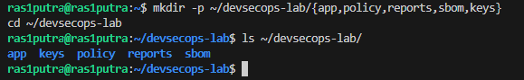
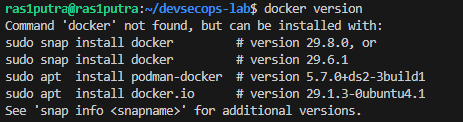
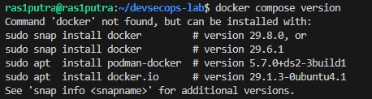
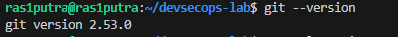
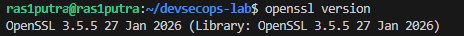
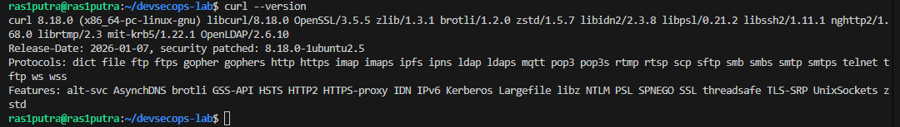
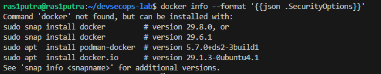
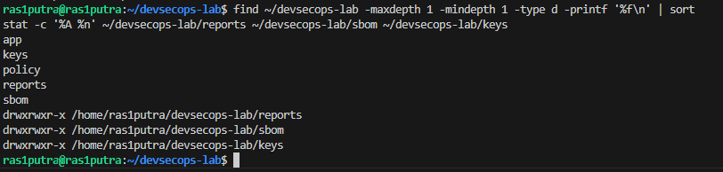

# LAPORAN PRAKTIKUM BAB 1
## Fondasi Teoretis dan Kerangka Kerja DevSecOps

**Nama**: Putra Yanuar Rasyid  
**NIM**: 3126640058  
**Kelas**: B  
**Tanggal pelaksanaan**: 21 September 2026  

## 1. Tujuan Praktikum

Praktikum pada Bab 1 ini dilaksanakan dengan tujuan untuk membangun fondasi lingkungan laboratorium DevSecOps yang terverifikasi. Proses verifikasi meliputi pembuatan struktur direktori kerja, pencatatan versi seluruh komponen yang digunakan, serta pemeriksaan aksesibilitas Docker Engine, Docker Compose v2, dan mekanisme keamanan yang aktif pada host.

Selain itu, praktikum ini melatih kemampuan membaca dan menginterpretasikan keluaran perintah secara kritis. Setiap hasil yang diperoleh tidak serta-merta dijadikan bukti keamanan, melainkan harus dianalisis dengan mempertimbangkan konteks sistem, versi perangkat yang digunakan, keterbatasan lingkungan, serta risiko yang berpotensi muncul.

## 2. Dasar Teori Singkat

DevSecOps merupakan evolusi dari DevOps yang menempatkan keamanan sebagai bagian integral dari setiap tahap siklus hidup pengembangan perangkat lunak, bukan sebagai lapisan tambahan di akhir proses. Pendekatan ini bersifat sosio-teknis karena melibatkan perubahan budaya kerja, pembagian tanggung jawab, dan otomasi kontrol keamanan secara bersamaan.

Dua prinsip utama yang menjadi landasan DevSecOps adalah *shift-left* dan *shift-right*. *Shift-left* mendorong pemeriksaan keamanan dilakukan sedini mungkin dalam siklus pengembangan, seperti pada tahap penulisan kode melalui SAST, SCA, secret scanning, dan threat modeling. *Shift-right* melengkapinya dengan pengujian dan pemantauan di lingkungan operasional, mencakup DAST, runtime detection, dan evaluasi pascainsiden.

Pencatatan baseline lingkungan merupakan langkah fundamental agar setiap eksperimen dapat direproduksi dan dibandingkan secara konsisten. Informasi seperti versi sistem operasi, kernel, Git, Docker, OpenSSL, dan cURL harus tercatat dengan lengkap sebelum eksperimen dimulai.

## 3. Alat dan Lingkungan

| Komponen | Hasil identifikasi |
|---|---|
| Operating system | Ubuntu 26.04.1 LTS |
| Kernel | Linux 7.0.0-31-generic, x86_64 |
| Pengguna eksekusi | `ras1putra` |
| Direktori kerja | `/home/ras1putra/devsecops-lab` |
| Git | 2.53.0 |
| OpenSSL | 3.5.5, 27 Januari 2026 |
| cURL | 8.18.0 |
| Docker Engine | Tidak tersedia (`docker: command not found`) |
| Docker Compose | Tidak dapat diverifikasi karena Docker tidak tersedia |

Catatan: penggunaan akun `ras1putra` (non-root) sudah sesuai dengan prinsip *least privilege* untuk lingkungan laboratorium.

## 4. Langkah Praktikum

### 4.1 Membuat Struktur Direktori

Perintah yang digunakan:

```bash
mkdir -p ~/devsecops-lab/{app,policy,reports,sbom,keys}
cd ~/devsecops-lab
```

Pada lingkungan pengujian ini, direktori dibuat pada lokasi kerja berikut:

```text
/home/ras1putra/devsecops-lab/
├── app/
├── keys/
├── policy/
├── reports/
├── sbom/
```



### 4.2 Mencatat Versi Perangkat

Perintah verifikasi:

```bash
docker version
```



```bash
docker compose version
```



```bash
git --version
```



```bash
openssl version
```



```bash
curl --version
```



```bash
docker info --format '{{json .SecurityOptions}}'
```



### 4.3 Verifikasi Direktori dan Permission

Perintah tambahan yang digunakan:

```bash
find ~/devsecops-lab \
  -maxdepth 1 -mindepth 1 -type d -printf '%f\n' | sort

stat -c '%A %n' \
  ~/devsecops-lab/reports \
  ~/devsecops-lab/sbom \
  ~/devsecops-lab/keys
```



## 5. Hasil Pengujian

### 5.1 Hasil Perintah Utama

| Pemeriksaan | Hasil aktual | Status |
|---|---|---|
| Struktur direktori lab | `app`, `policy`, `reports`, `sbom`, dan `keys` berhasil dibuat | Terpenuhi |
| `docker version` | `docker: command not found` | Gagal/terblokir |
| `docker compose version` | Tidak dapat dijalankan karena Docker tidak tersedia | Gagal/terblokir |
| `git --version` | `git version 2.53.0` | Terpenuhi |
| `openssl version` | `OpenSSL 3.5.5 27 Jan 2026` | Terpenuhi |
| `curl --version` | `curl 8.18.0` | Terpenuhi |
| `docker info ... SecurityOptions` | `docker: command not found` | Gagal/terblokir |
| Direktori `reports`, `sbom`, `keys` tersedia | Ketiga direktori tersedia | Terpenuhi sebagian |
| Permission direktori | `drwxr-xr-x` | Teridentifikasi; perlu hardening |
| Direktori bukan web root | Berada di bawah home user, tetapi konfigurasi web server tidak diperiksa | Belum terverifikasi |

### 5.2 Bukti Output

Output perangkat yang tersedia:

```text
git version 2.53.0
OpenSSL 3.5.5 27 Jan 2026 (Library: OpenSSL 3.5.5 27 Jan 2026)
curl 8.18.0 (x86_64-pc-linux-gnu) libcurl/8.18.0 OpenSSL/3.5.5
```

Output pemeriksaan Docker:

```text
docker: command not found
```

Output permission direktori:

```text
drwxr-xr-x /home/ras1putra/devsecops-lab/reports
drwxr-xr-x /home/ras1putra/devsecops-lab/sbom
drwxr-xr-x /home/ras1putra/devsecops-lab/keys
```

## 6. Threat Statement

Aset utama yang perlu dilindungi dalam lingkungan praktikum ini meliputi source code, konfigurasi pipeline CI/CD, laporan hasil pemindaian, SBOM, image container, dan material kriptografi seperti kunci dan sertifikat. Ancaman dapat berasal dari pengguna lokal yang tidak memiliki otorisasi, proses yang berjalan di host dengan hak berlebih, maupun pihak eksternal yang berhasil mendapatkan akses ke repository atau kredensial pipeline.

Potensi jalur serangan yang perlu diwaspadai antara lain eksfiltrasi secret yang tersimpan di repositori, injeksi dependensi berbahaya ke dalam build, manipulasi artefak image, serta eksposur tidak sengaja terhadap laporan atau kunci melalui konfigurasi direktori yang terlalu permisif. Dampak yang dapat ditimbulkan mencakup kebocoran data sensitif, artefak yang tidak dapat dipercaya, kegagalan deployment, hingga kompromi pada host atau infrastruktur yang lebih luas.

Pada tahap baseline ini, risiko utama adalah belum terpasangnya Docker Engine sehingga sebagian besar eksperimen container belum dapat dijalankan. Selain itu, permission direktori `755` yang merupakan default `mkdir` masih memungkinkan pengguna lain di sistem untuk membaca isi direktori. Direktori `keys` secara khusus perlu mendapat perhatian lebih — idealnya menggunakan permission `700` dan tidak menyimpan kunci nyata di repository.

## 7. Analisis

Pembuatan struktur direktori berjalan sesuai ekspektasi. Direktori `app`, `policy`, `reports`, `sbom`, dan `keys` berhasil terbentuk di bawah `~/devsecops-lab`. Pemisahan direktori ini penting untuk menjaga keteraturan artefak — laporan hasil scan, inventaris komponen SBOM, dan material kriptografi tidak bercampur dalam satu lokasi. Meski demikian, keberadaan direktori tidak otomatis menjamin keamanan data di dalamnya. Diperlukan pengaturan permission yang tepat dan kepastian bahwa direktori tersebut tidak terekspos melalui web server manapun.

Dari sisi perangkat pendukung, Git 2.53.0, OpenSSL 3.5.5, dan cURL 8.18.0 berhasil teridentifikasi dan siap digunakan pada eksperimen selanjutnya. Ketiganya merupakan komponen penting: Git untuk version control dan audit trail perubahan, OpenSSL untuk operasi kriptografi, dan cURL untuk pengujian komunikasi HTTP/HTTPS.

Ketidaktersediaan Docker Engine menjadi hambatan signifikan. Tiga poin verifikasi yang bergantung pada Docker — pemeriksaan daemon, Compose v2, dan `SecurityOptions` — tidak dapat diselesaikan. Perlu dilakukan instalasi Docker melalui prosedur resmi sebelum praktikum berikutnya, diikuti pengulangan seluruh pemeriksaan ini.

Penting untuk dipahami bahwa output `SecurityOptions` sekalipun, jika nanti tersedia, hanya mencerminkan mekanisme keamanan yang diaktifkan di level daemon dan host — bukan jaminan bahwa setiap container telah dikonfigurasi secara aman. Hardening container memerlukan langkah tambahan seperti pembatasan Linux capabilities, penerapan seccomp/AppArmor, dan penggunaan user non-root di dalam container.

## 8. Tindak Lanjut

1. Menyiapkan VM atau host Linux yang didedikasikan untuk laboratorium DevSecOps.
2. Melakukan instalasi Docker Engine dan plugin Docker Compose v2 menggunakan repository resmi Docker.
3. Menjalankan ulang seluruh perintah verifikasi Docker dan mencatat hasilnya beserta versi dan konfigurasi yang aktif.
4. Memastikan praktikum dijalankan dengan akun non-root dan menerapkan prinsip *least privilege* secara konsisten.
5. Mengatur permission direktori `keys` menjadi lebih ketat (misalnya `700`) sesuai kebutuhan akses minimal.
6. Memverifikasi bahwa direktori `reports`, `sbom`, dan `keys` tidak dapat diakses melalui web server yang berjalan di host.
7. Menyimpan hasil baseline ke repository Git, dengan memastikan tidak ada secret atau kunci nyata yang ikut ter-commit.

## 9. Kesimpulan

Praktikum Bab 1 telah berhasil menyelesaikan sebagian dari proses penetapan baseline laboratorium DevSecOps. Struktur direktori kerja terbentuk dengan baik, dan tiga komponen pendukung — Git 2.53.0, OpenSSL 3.5.5, serta cURL 8.18.0 — berhasil terverifikasi. Di sisi lain, Docker Engine belum tersedia di lingkungan VM yang digunakan, sehingga verifikasi Docker, Docker Compose v2, dan `SecurityOptions` tidak dapat diselesaikan pada sesi ini.

Hasil praktikum ini menegaskan bahwa laporan harus didasarkan pada bukti nyata dari lingkungan yang digunakan, bukan sekadar menyalin contoh output. Baseline yang valid baru dapat dinyatakan lengkap setelah Docker terpasang, seluruh pemeriksaan diulang, dan aspek keamanan direktori diperkuat. Dengan baseline yang solid, eksperimen pada bab-bab berikutnya akan dapat dilaksanakan secara lebih andal, aman, dan dapat direproduksi.

## 10. Evaluasi dan Latihan Mandiri

**1. Mengapa DevSecOps tidak dapat direduksi menjadi penambahan scanner pada pipeline?**

Scanner adalah alat, bukan pendekatan. Menambahkan scanner ke pipeline tanpa membangun budaya, ownership, dan proses tindak lanjut hanya menghasilkan daftar temuan yang tidak ditangani. DevSecOps mensyaratkan bahwa setiap temuan memiliki pemilik yang jelas, kriteria penerimaan yang terdefinisi (gate), dan evidence bahwa tindakan koreksi telah dilakukan dan dapat diverifikasi. Tanpa komponen sosial dan tata kelola tersebut, scanner hanya menjadi penghasil noise yang akhirnya diabaikan oleh tim.

**2. Evidence apa yang membedakan klaim kontrol dari kontrol yang benar-benar terverifikasi?**

Klaim kontrol adalah pernyataan bahwa suatu pemeriksaan atau mekanisme sudah berjalan tanpa bukti yang dapat diperiksa ulang. Kontrol yang terverifikasi memiliki: (a) artefak yang dapat dikaitkan ke commit atau waktu tertentu, (b) identitas tool dan versinya, (c) input dan output yang tercatat, dan (d) dapat direproduksi oleh pihak lain secara independen. Pada praktikum ini, output `git --version`, `openssl version`, dan `curl --version` adalah evidence terverifikasi karena menunjukkan versi spesifik pada lingkungan nyata — bukan contoh output yang disalin dari dokumentasi.

**3. Bagaimana shared responsibility memengaruhi ownership risiko dan tindak lanjut temuan?**

Shared responsibility berarti tidak ada satu pihak yang bertanggung jawab atas seluruh aspek keamanan. Developer bertanggung jawab atas kode dan dependensi; operator bertanggung jawab atas konfigurasi runtime dan infra; security bertanggung jawab atas policy dan verifikasi. Masalah muncul ketika batas tanggung jawab tidak jelas — temuan hasil scan dibiarkan karena masing-masing pihak menganggap itu tanggung jawab pihak lain. Solusinya adalah mendefinisikan ownership per kategori temuan sebelum pipeline berjalan, bukan setelah temuan muncul.

## 11. Referensi

1. Ferry Astika Saputra, "Bab 1 — Fondasi Teoretis dan Kerangka Kerja DevSecOps," repository DevSecOps PENS, `bab-01.md`, diakses 21 September 2026: https://github.com/ferryas-pens/devsecops/blob/main/bab-01.md
2. NIST SP 800-218, *Secure Software Development Framework (SSDF) Version 1.1*.
3. OWASP, *DevSecOps Guideline*.
