# LAPORAN PRAKTIKUM BAB 2
## Konsep Container dan Instalasi Docker

**Nama**: Putra Yanuar Rasyid  
**NIM**: 3126640058  
**Kelas**: B  
**Tanggal pelaksanaan**: 22 September 2026  

## 1. Tujuan Praktikum

Praktikum Bab 2 bertujuan memahami konsep containerization secara mendalam serta mengimplementasikannya melalui instalasi Docker Engine pada sistem Ubuntu. Praktikum ini mencakup pemahaman perbedaan container dan virtual machine, pengenalan komponen utama Docker, serta pengoperasian container pertama menggunakan image dari Docker Hub.

Selain itu, praktikum ini melatih kemampuan membangun image custom menggunakan Dockerfile dan menjalankannya sebagai container yang dapat diakses melalui jaringan. Setiap langkah diverifikasi dengan bukti output nyata untuk memastikan pemahaman yang tidak sekadar teoritis.

## 2. Dasar Teori Singkat

Container adalah unit isolasi proses pada Linux yang mengemas aplikasi beserta dependensinya menggunakan namespace dan cgroup kernel. Berbeda dengan virtual machine yang membawa guest OS tersendiri, container berbagi kernel host sehingga memiliki overhead yang jauh lebih rendah dan waktu startup lebih cepat.

Docker Engine menyediakan tiga komponen utama: Docker client (CLI), Docker daemon yang mengelola lifecycle image dan container, serta Docker registry sebagai penyimpan image. Image bersifat read-only dan tersusun dari beberapa layer menggunakan strategi copy-on-write. Saat container dibuat, Docker menambahkan writable layer di atas image read-only tersebut.

Dockerfile adalah spesifikasi deklaratif untuk membangun image. Instruksi `FROM` menentukan base image, `COPY` menyalin file ke dalam image, `EXPOSE` mendokumentasikan port, dan `CMD` mendefinisikan perintah default container. Multi-stage build dapat digunakan untuk memisahkan lingkungan build dari runtime demi menghasilkan image yang lebih kecil dan aman.

## 3. Alat dan Lingkungan

| Komponen | Hasil identifikasi |
|---|---|
| Operating system | Ubuntu 26.04.1 LTS |
| Kernel | Linux 7.0.0-31-generic, x86_64 |
| Pengguna eksekusi | `ras1putra` |
| Docker Engine | 29.8.1 (Community) |
| containerd | v2.3.5 |
| runc | v1.5.1 |
| Docker API version | 1.56 |
| Direktori kerja | `~/docker-lab/` |

## 4. Langkah Praktikum

### 4.1 Instalasi Docker Engine

Instalasi dilakukan menggunakan repository resmi Docker untuk Ubuntu. Langkah pertama adalah memperbarui daftar paket sistem.

```bash
sudo apt update
```

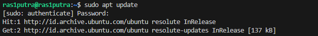

Selanjutnya, paket prasyarat untuk koneksi HTTPS dan manajemen GPG key dipasang.

```bash
sudo apt install -y ca-certificates curl gnupg lsb-release
```

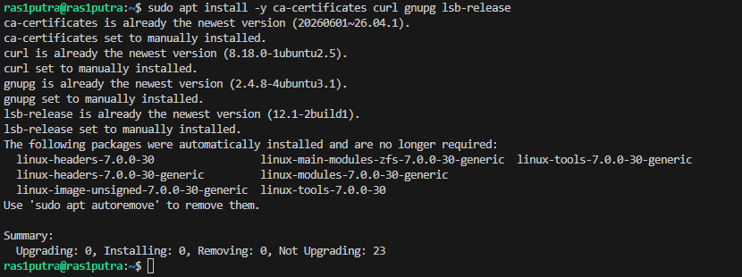

GPG key resmi Docker diunduh dan disimpan, lalu repository Docker ditambahkan ke daftar sumber paket sistem.

```bash
sudo install -m 0755 -d /etc/apt/keyrings
curl -fsSL https://download.docker.com/linux/ubuntu/gpg | sudo gpg --dearmor -o /etc/apt/keyrings/docker.gpg
sudo chmod a+r /etc/apt/keyrings/docker.gpg
echo "deb [arch=$(dpkg --print-architecture) signed-by=/etc/apt/keyrings/docker.gpg] https://download.docker.com/linux/ubuntu $(lsb_release -cs) stable" | sudo tee /etc/apt/sources.list.d/docker.list > /dev/null
```

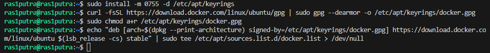

Daftar paket diperbarui kembali untuk menyertakan repository Docker yang baru ditambahkan.

```bash
sudo apt update
```

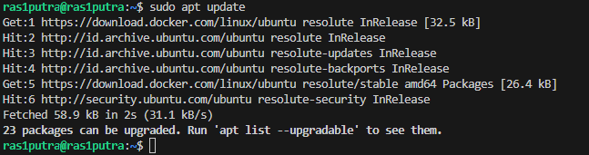

Docker CE, CLI, containerd, dan plugin Compose dipasang sekaligus.

```bash
sudo apt install -y docker-ce docker-ce-cli containerd.io docker-buildx-plugin docker-compose-plugin
```

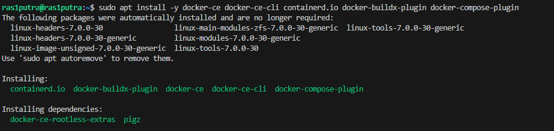

Pengguna ditambahkan ke grup `docker` agar dapat menjalankan perintah Docker tanpa `sudo`, kemudian versi Docker diverifikasi.

```bash
sudo usermod -aG docker $USER
newgrp docker
docker version
```

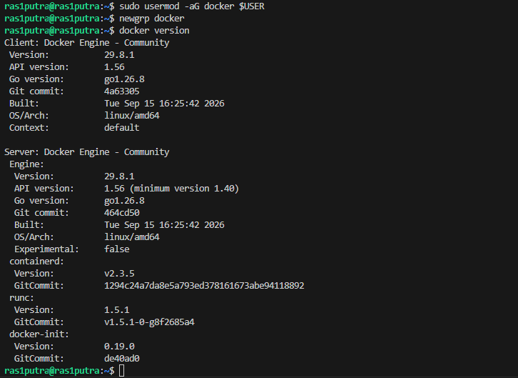

Pengujian instalasi dilakukan dengan menjalankan container `hello-world`.

```bash
docker run hello-world
```

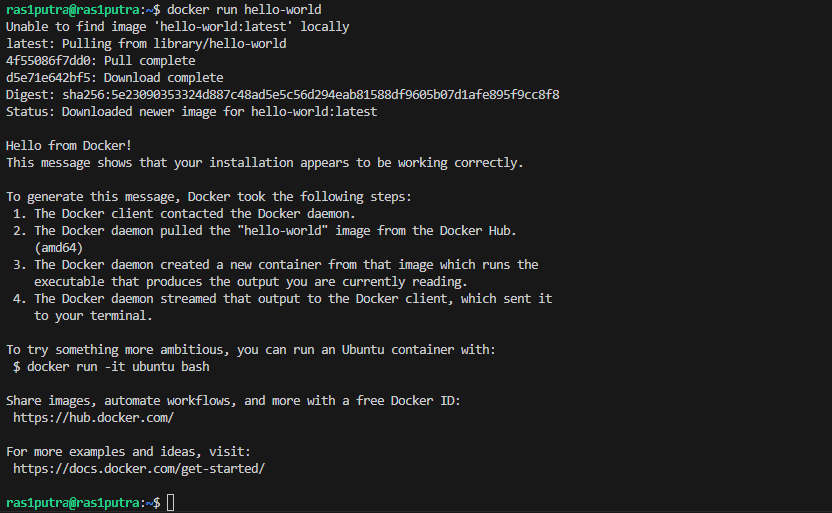

### 4.2 Menjalankan Container Nginx dan Ubuntu Interaktif

Image Nginx versi 1.26 diunduh dari Docker Hub, kemudian dijalankan sebagai container dengan nama `web-public` yang dipublikasikan di port 8080.

```bash
docker pull nginx:1.26
docker run -d --name web-public -p 8080:80 nginx:1.26
docker ps
```

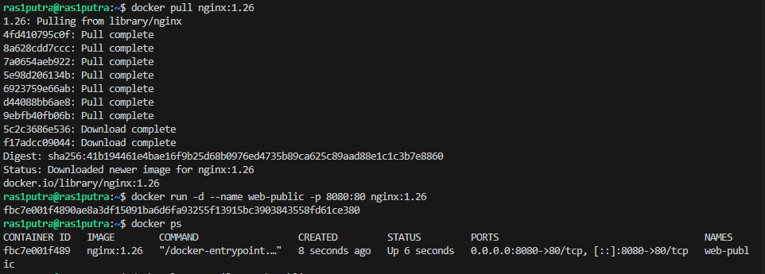

Log container diperiksa untuk memastikan Nginx berjalan, lalu respons HTTP diuji menggunakan `curl`.

```bash
docker logs --tail 20 web-public
curl http://localhost:8080
```

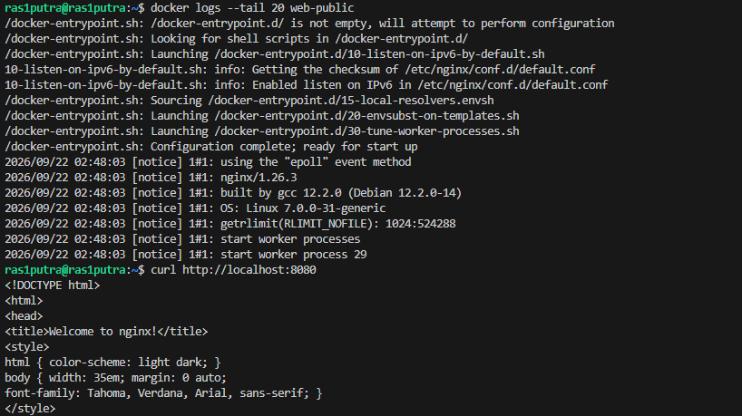

Container Ubuntu 22.04 dijalankan secara interaktif untuk memeriksa informasi sistem operasi di dalam container.

```bash
docker run -it --name ubuntu-test ubuntu:22.04 /bin/bash
cat /etc/os-release
exit
```

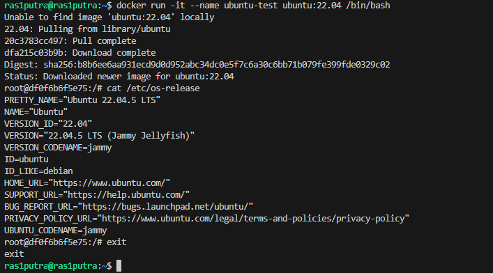

Kedua container dibersihkan setelah pengujian selesai.

```bash
docker rm -f web-public ubuntu-test
```

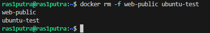

### 4.3 Membangun Image Custom dengan Dockerfile

Direktori kerja dibuat dan file `index.html` serta `Dockerfile` disiapkan untuk membangun image web statis berbasis Nginx Alpine.

```bash
mkdir -p ~/docker-lab/custom-web && cd ~/docker-lab/custom-web
cat > index.html << 'EOF'
<h1>Docker Lab PENS</h1>
<p>Container berhasil berjalan.</p>
EOF
cat > Dockerfile << 'EOF'
FROM nginx:1.26-alpine
LABEL maintainer="admin@pens.ac.id"
COPY index.html /usr/share/nginx/html/index.html
EXPOSE 80
CMD ["nginx", "-g", "daemon off;"]
EOF
```

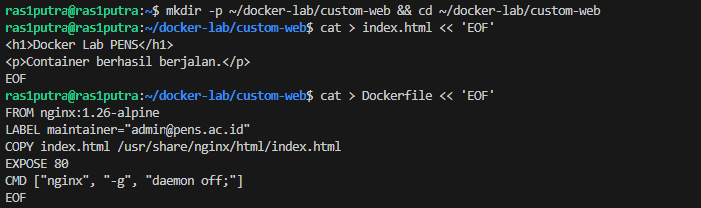

Image dibangun dari Dockerfile, container dijalankan di port 9090, dan hasilnya diverifikasi dengan `curl`.

```bash
docker build -t pens-web:1.0 .
docker run -d --name pens-app -p 9090:80 pens-web:1.0
curl http://localhost:9090
```

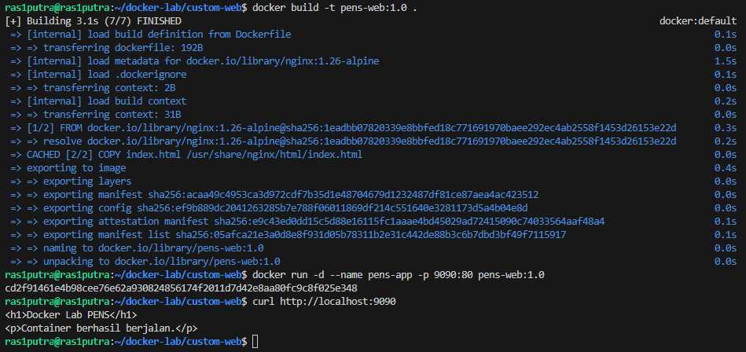

## 5. Hasil Pengujian

### 5.1 Hasil Perintah Utama

| Pemeriksaan | Hasil aktual | Status |
|---|---|---|
| `sudo apt update` | Repository diperbarui | Terpenuhi |
| Instalasi prasyarat (ca-certificates, curl, gnupg) | Semua sudah versi terbaru | Terpenuhi |
| Setup GPG key dan docker.list | File tersimpan di `/etc/apt/keyrings/docker.gpg` | Terpenuhi |
| `sudo apt update` (repo Docker) | Docker repo `resolute/stable amd64` aktif | Terpenuhi |
| `sudo apt install docker-ce...` | containerd.io, docker-ce, docker-ce-cli, docker-buildx-plugin, docker-compose-plugin terpasang | Terpenuhi |
| `docker version` | Client & Server 29.8.1, API 1.56, containerd v2.3.5, runc v1.5.1 | Terpenuhi |
| `docker run hello-world` | "Hello from Docker!" — instalasi bekerja | Terpenuhi |
| `docker pull nginx:1.26` + `docker run` + `docker ps` | Container `web-public` UP, port `0.0.0.0:8080->80/tcp` | Terpenuhi |
| `docker logs` + `curl localhost:8080` | Log Nginx normal; `curl` mengembalikan HTML default Nginx | Terpenuhi |
| `docker run ubuntu:22.04` interaktif | Ubuntu 22.04.5 LTS (Jammy Jellyfish) terverifikasi | Terpenuhi |
| `docker rm -f web-public ubuntu-test` | Kedua container dihapus | Terpenuhi |
| `docker build -t pens-web:1.0 .` | Image berhasil dibangun dalam 3.1s (7/7 layers) | Terpenuhi |
| `docker run pens-app` + `curl localhost:9090` | Respons: `<h1>Docker Lab PENS</h1>` | Terpenuhi |
| User non-root dapat menjalankan Docker | `ras1putra` berhasil menjalankan Docker setelah `newgrp docker` | Terpenuhi |

### 5.2 Bukti Output

Output `docker version`:

```text
Client: Docker Engine - Community
  Version: 29.8.1
  API version: 1.56

Server: Docker Engine - Community
  Engine Version: 29.8.1
  containerd Version: v2.3.5
  runc Version: v1.5.1
```

Output `curl http://localhost:9090`:

```text
<h1>Docker Lab PENS</h1>
<p>Container berhasil berjalan.</p>
```

## 6. Threat Statement

Dalam konteks bab ini, aset yang perlu dilindungi adalah image yang dibangun (`pens-web:1.0`), Dockerfile dan source code yang digunakan, konfigurasi port yang dipublikasikan, serta akses ke Docker daemon melalui socket. Image yang dibangun dari base image tidak terverifikasi berpotensi membawa CVE atau backdoor yang tidak terdeteksi. Dockerfile yang menyertakan secret (token, password) dalam instruksi `RUN` atau `COPY` akan menyimpannya secara permanen di dalam layer image.

Risiko operasional terbesar pada bab ini adalah keanggotaan grup `docker`. Pengguna yang masuk ke grup `docker` dapat menjalankan `docker run --privileged -v /:/host ...` untuk mengakses seluruh filesystem host. Ini secara efektif setara dengan akses root pada host, meskipun pengguna tersebut bukan root. Risiko ini sering diremehkan karena terlihat seperti pengaturan biasa.

Publikasi port tanpa pembatasan interface (`0.0.0.0:8080->80`) mengekspos container ke semua interface jaringan host, termasuk interface yang menghadap ke jaringan eksternal. Pada lingkungan cloud atau VM dengan IP publik, ini dapat membuat layanan internal terekspos ke internet tanpa firewall tambahan.

## 7. Analisis

**Masalah yang ditemukan:** Saat menjalankan `docker ps` setelah `newgrp docker`, sesi shell baru terbentuk sehingga variabel environment dan alias dari sesi sebelumnya tidak otomatis terbawa. Ini bukan bug, melainkan perilaku normal `newgrp` yang membuat child shell. Solusinya adalah login ulang atau menggunakan `exec su - $USER` agar perubahan grup berlaku secara permanen tanpa perlu `newgrp` setiap kali.

**Peran containerd dan runc dalam arsitektur Docker:** Docker daemon tidak langsung membuat container. Daemon mendelegasikan ke `containerd` (v2.3.5) yang mengelola lifecycle container secara high-level: image pull, snapshot storage, dan manajemen proses. `containerd` kemudian memanggil `runc` (v1.5.1) sebagai low-level OCI runtime yang benar-benar membuat namespace, cgroup, dan menjalankan proses di dalam container. Pemisahan ini memungkinkan komponen diganti secara independen — misalnya containerd dapat digunakan tanpa Docker daemon, seperti pada Kubernetes.

**Mengapa tag `latest` tidak dianjurkan:** Pada praktikum ini digunakan tag `nginx:1.26` (pinned), bukan `nginx:latest`. Tag `latest` adalah pointer yang bergerak — setiap `docker pull nginx:latest` dapat mengunduh versi berbeda tergantung kapan perintah dijalankan. Ini membuat build tidak reproducible: dua engineer yang menjalankan pipeline di waktu berbeda bisa mendapatkan image yang berbeda. Sebaliknya, `nginx:1.26` selalu menunjuk ke versi yang sama. Penggunaan digest (`sha256:41b194...`) memberikan jaminan lebih kuat karena terikat pada content, bukan nama tag.

**Perbedaan EXPOSE dan `-p`:** Instruksi `EXPOSE 80` dalam Dockerfile hanya bersifat dokumentasi metadata — ia memberitahu pengguna bahwa aplikasi mendengarkan di port 80, tetapi tidak membuka port tersebut ke host. Port baru benar-benar terpublikasi ketika opsi `-p 8080:80` ditambahkan saat `docker run`, yang membuat iptables rule di host untuk meneruskan traffic dari port 8080 host ke port 80 container.

**VM vs Container:** Container lebih tepat dipilih untuk workload stateless, deployment cepat, microservices, dan CI/CD seperti pada praktikum ini. VM lebih tepat ketika dibutuhkan isolasi kernel yang lebih kuat (misalnya menjalankan guest OS berbeda), workload dengan kebutuhan keamanan tinggi yang tidak boleh berbagi kernel, atau workload legacy yang tidak kompatibel dengan containerization.

## 8. Rekomendasi untuk Production

Bila laboratorium ini dibawa ke lingkungan production-like, beberapa perbaikan diperlukan:

1. **Batasi binding port ke loopback atau IP spesifik**: Gunakan `-p 127.0.0.1:8080:80` bukan `-p 8080:80` agar layanan tidak terekspos ke semua interface. Tempatkan reverse proxy (Nginx atau Traefik) sebagai satu-satunya titik masuk eksternal.
2. **Jalankan proses sebagai non-root di dalam container**: Tambahkan instruksi `USER nginx` atau buat user khusus di Dockerfile. Container yang berjalan sebagai root di dalam akan menjadi root di host jika terjadi container escape.
3. **Pin base image menggunakan digest**: Ganti `FROM nginx:1.26-alpine` dengan `FROM nginx:1.26-alpine@sha256:1eadbb...` untuk memastikan build selalu menggunakan layer yang persis sama.
4. **Scan image sebelum deployment**: Jalankan `trivy image pens-web:1.0` untuk mendeteksi CVE pada paket Alpine sebelum image dijalankan.
5. **Hapus grup docker dari akun non-admin**: Gunakan rootless Docker atau socket proxy (seperti `docker-socket-proxy`) untuk membatasi akses daemon tanpa memberikan privilege penuh grup `docker`.
6. **Gunakan `.dockerignore`**: Pastikan file `.env`, `*.key`, `*.pem`, dan direktori seperti `.git` tidak masuk ke build context.

## 9. Kesimpulan

Praktikum Bab 2 berhasil membuktikan seluruh alur kerja container dari instalasi hingga build image custom. Docker Engine 29.8.1 terpasang dengan arsitektur berlapis: CLI → daemon → containerd → runc, di mana setiap lapisan memiliki tanggung jawab berbeda. Container Nginx dan Ubuntu berhasil dijalankan secara bersamaan di atas host Ubuntu 26.04 tanpa konflik, memperlihatkan isolasi namespace yang bekerja.

Dua konsep penting yang terkonfirmasi melalui praktikum: pertama, `EXPOSE` hanya metadata dan tidak membuka port — `-p` yang benar-benar membuat port tersedia dari host. Kedua, grup `docker` bukan mekanisme least privilege; keanggotaan di dalamnya secara efektif memberikan kontrol penuh atas host melalui container privileged. Kedua pemahaman ini krusial sebelum melanjutkan ke bab-bab berikutnya yang melibatkan orkestrasi dan security hardening container.

## 10. Evaluasi dan Latihan Mandiri

**1. Mengapa penggunaan tag `latest` tidak dianjurkan untuk deployment yang harus reproducible?**

Tag `latest` adalah pointer dinamis yang berpindah setiap kali maintainer merilis versi baru. Dua eksekusi `docker pull nginx:latest` di waktu berbeda dapat menghasilkan image yang berbeda tanpa peringatan apapun. Ini membuat build tidak dapat direproduksi: tim A yang menjalankan pipeline pada bulan ini dan tim B yang menjalankannya bulan depan bisa mendapatkan image dengan versi dan CVE yang berbeda. Solusinya adalah menggunakan tag spesifik seperti `nginx:1.26` atau, untuk jaminan lebih kuat, pin menggunakan digest SHA256 (`nginx:1.26-alpine@sha256:1eadbb...`) yang terikat langsung pada content image.

**2. Jelaskan peran containerd dan runc dalam arsitektur Docker.**

Docker menggunakan arsitektur berlapis. Docker CLI mengirim perintah ke Docker daemon melalui API. Daemon mendelegasikan pengelolaan container ke `containerd` (high-level runtime, v2.3.5 pada praktikum ini) yang bertanggung jawab atas image pull, snapshot storage, dan lifecycle management. `containerd` kemudian memanggil `runc` (low-level OCI runtime, v1.5.1) yang benar-benar membuat namespace, cgroup, dan menjalankan proses container sesuai OCI Runtime Specification. Pemisahan ini membuat setiap komponen dapat diganti secara independen — Kubernetes menggunakan containerd langsung tanpa Docker daemon, dan runtime alternatif seperti gVisor atau Kata Containers dapat menggantikan runc untuk isolasi yang lebih kuat.

**3. Apa konsekuensi keamanan dari memasukkan user ke group `docker`?**

Keanggotaan grup `docker` memberikan akses langsung ke Docker socket (`/var/run/docker.sock`). Pengguna dengan akses socket ini dapat menjalankan `docker run --privileged -v /:/host ubuntu chroot /host` untuk mendapatkan shell root pada filesystem host — tanpa memerlukan `sudo`. Secara efektif, grup `docker` setara dengan akses root penuh pada host, meskipun pengguna tersebut bukan member grup `sudo`. Untuk lingkungan produksi, gunakan rootless Docker, socket proxy yang membatasi operasi yang diizinkan, atau sistem orkestrasi seperti Kubernetes yang memiliki RBAC lebih granular.

**4. Bandingkan layer image `nginx:1.26-alpine` dan image custom `pens-web:1.0` yang dibuat.**

Image `nginx:1.26-alpine` adalah base image berbasis Alpine Linux yang sudah minimal — hanya menyertakan Nginx dan dependensi minimumnya. Image custom `pens-web:1.0` dibangun di atas `nginx:1.26-alpine` dengan menambahkan satu layer `COPY` yang menyalin `index.html`. Output `docker build` menunjukkan 7 layer diproses, di mana layer 1 (FROM) di-resolve dari registry dan layer 2 (COPY) adalah tambahan dari Dockerfile kita. Ukuran `pens-web:1.0` hampir identik dengan `nginx:1.26-alpine` karena perubahan hanya satu file HTML kecil — ini membuktikan efisiensi layer copy-on-write Docker.

**5. Kapan sebaiknya memilih VM daripada container?**

VM lebih tepat dipilih ketika: (a) dibutuhkan isolasi kernel yang kuat — misalnya menjalankan workload dari tenant berbeda yang tidak boleh berbagi kernel; (b) aplikasi membutuhkan guest OS berbeda (misalnya Windows di atas Linux host); (c) workload legacy memiliki dependensi kernel spesifik yang tidak kompatibel dengan container; (d) regulasi atau compliance mensyaratkan boundary hypervisor (misalnya PCI-DSS untuk beberapa skenario); atau (e) aplikasi membutuhkan akses hardware langsung seperti GPU passthrough. Container lebih unggul untuk microservices, CI/CD, dan workload stateless yang membutuhkan startup cepat dan density tinggi.

## 11. Referensi

1. Ferry Astika Saputra, "Bab 2 — Konsep Container dan Instalasi Docker," repository DevSecOps PENS, `bab-02.md`, diakses 22 September 2026: https://github.com/ferryas-pens/devsecops/blob/main/bab-02.md
2. Docker Inc., *Docker Engine Documentation*, https://docs.docker.com/engine/
3. Open Container Initiative, *OCI Image Specification*, https://github.com/opencontainers/image-spec
4. NIST SP 800-218, *Secure Software Development Framework (SSDF) Version 1.1*.
