# LAPORAN PRAKTIKUM BAB 3
## Docker Network, Volume, Bind Mount, tmpfs, dan Compose

**Nama**: Putra Yanuar Rasyid  
**NIM**: 3126640058  
**Kelas**: B  
**Tanggal pelaksanaan**: 22 September 2026  

## 1. Tujuan Praktikum

Praktikum Bab 3 bertujuan memahami arsitektur komunikasi jaringan, persistensi data, dan orkestrasi deklaratif pada Docker. Mahasiswa dilatih untuk:
1. Membangun dan menguji *user-defined bridge network* untuk membuktikan resolusi nama (*DNS discovery*) internal antar-container.
2. Menguji siklus hidup (*lifecycle*) persistensi data pada *Docker Volume* serta menerapkan strategi backup volume ke dalam arsip terkompresi.
3. Menulis dan mengonfigurasi file deklaratif multi-container menggunakan Docker Compose yang mencakup service Nginx, backend Flask, dan database PostgreSQL.
4. Menerapkan segmentasi jaringan (*network isolation*), manajemen storage (*volume* dan *bind mount*), penyesuaian hak akses non-root, serta integrasi *healthcheck* database sebagai kesiapan *dependency*.

## 2. Dasar Teori Singkat

Jaringan container pada dasarnya adalah graf keterjangkauan (*reachability graph*). Docker menyediakan default bridge dan *user-defined bridge*. Pada *user-defined bridge*, Docker Engine mengaktifkan embedded DNS resolver sehingga container dapat saling berkomunikasi menggunakan nama container atau alias service tanpa bergantung pada IP dinamis yang rentan berubah saat restart.

Dalam pengelolaan data, Docker membedakan tiga tipe storage utama:
- **Volume**: Dikelola secara internal oleh Docker daemon di `/var/lib/docker/volumes/`. Siklus hidup volume independen dari container (*decoupled*), menjadikannya standar baku untuk database dan file persisten.
- **Bind mount**: Memetakan file atau direktori spesifik dari host langsung ke dalam container filesystem. Bind mount sangat berguna untuk live-code development dan konfigurasi, namun memiliki keterikatan tinggi terhadap permission host.
- **tmpfs mount**: Menyimpan data di memori volatile (RAM) host dan musnah seketika container berhenti. Sangat ideal untuk file temporer sensitif atau token agar tidak tersimpan ke writable layer.

Docker Compose memungkinkan definisi aplikasi multi-tier dalam file YAML tunggal. Selain mengotomatisasi pembuatan network, volume, dan container, Compose mendukung healthcheck untuk memastikan dependensi antar-layanan (seperti aplikasi yang menunggu database siap menerima koneksi melalui `condition: service_healthy`) berjalan dengan urutan yang benar.

## 3. Alat dan Lingkungan

| Komponen | Spesifikasi / Nilai |
|---|---|
| Sistem Operasi | Ubuntu 26.04.1 LTS (via SSH VM) |
| Kernel | Linux 7.0.0-31-generic x86_64 |
| Akun Pengguna | `ras1putra` |
| Docker Engine | 29.8.1 (Community) |
| Docker Compose | v2.33.1 / plugin Compose v2 |
| Direktori Kerja | `~/docker-lab/bab-3/` |
| Port Host Terpetakan | `127.0.0.1:8080` (Nginx Web Reverse Proxy) |

## 4. Langkah Praktikum

### 4.1 User-Defined Bridge Network dan DNS Internal

Langkah pertama adalah membuat jaringan bridge custom dengan subnet `172.20.0.0/16` bernama `lab-net`, kemudian menjalankan dua container Nginx (`server-a` dan `server-b`) yang saling terhubung ke jaringan tersebut, lalu menguji konektivitas menggunakan nama container.

```bash
mkdir -p ~/docker-lab/bab-3 && cd ~/docker-lab/bab-3
docker network create --driver bridge --subnet 172.20.0.0/16 lab-net
docker run -d --name server-a --network lab-net nginx:alpine
docker run -d --name server-b --network lab-net nginx:alpine
docker exec server-a ping -c 3 server-b
docker rm -f server-a server-b
```

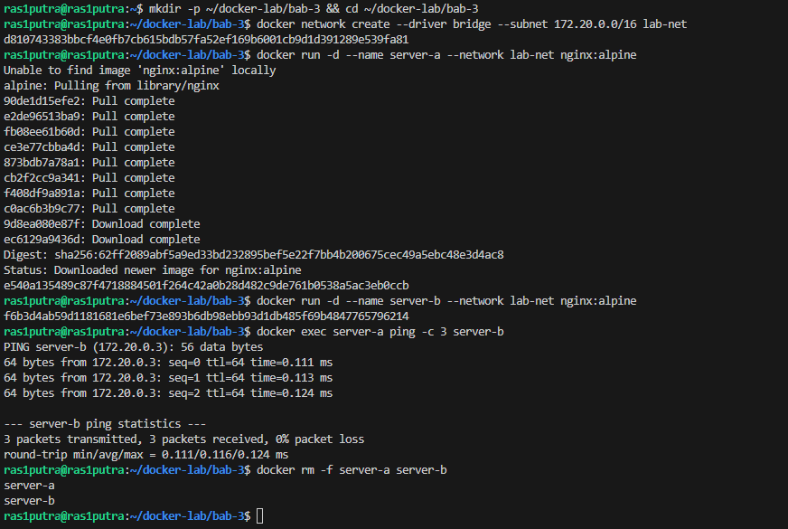

Container `server-a` berhasil me-resolve nama `server-b` ke alamat IP `172.20.0.3` secara otomatis melalui embedded DNS resolver Docker dan menerima 3 paket ICMP dengan 0% packet loss. Setelah pengujian berhasil, kedua container dibersihkan.

---

### 4.2 Pengujian Persistensi Volume dan Backup Tar

Langkah kedua menguji independensi siklus hidup Docker Volume terhadap container. Sebuah volume bernama `data-vol` dibuat, lalu container `writer` menulis log waktu setiap 5 detik ke file `/app/data/log.txt`. Container `writer` kemudian dihapus paksa (`rm -f`), dan container baru dijalankan untuk memverifikasi apakah data log tetap utuh. Terakhir, isi volume di-backup menjadi arsip terkompresi `.tar.gz`.

```bash
docker volume create data-vol
docker run -d --name writer -v data-vol:/app/data alpine:3.20 \
  sh -c "while true; do date >> /app/data/log.txt; sleep 5; done"
sleep 15
docker rm -f writer
docker run --rm -v data-vol:/data alpine:3.20 cat /data/log.txt
docker run --rm -v data-vol:/source:ro -v $(pwd):/backup alpine:3.20 \
  tar czf /backup/data-vol-backup.tar.gz -C /source .
ls -lh data-vol-backup.tar.gz
```

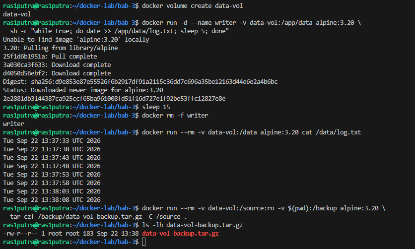

File log mencatat 8 baris timestamp UTC secara berurutan. Meskipun container `writer` telah musnah, seluruh data log tetap tersimpan utuh di volume `data-vol`. File backup `data-vol-backup.tar.gz` berhasil dihasilkan di host dengan ukuran 183 byte.

---

### 4.3 Implementasi Multi-Container Docker Compose (Nginx, Flask, PostgreSQL)

#### 4.3.1 Pembuatan Struktur Direktori dan File Konfigurasi

Langkah berikutnya adalah membangun arsitektur aplikasi web tiga lapis (*three-tier architecture*) yang terdiri atas Nginx (reverse proxy/web), Flask (backend API), dan PostgreSQL (database).

Membuat folder aplikasi:
```bash
cd ~/docker-lab/bab-3
mkdir -p app html
```

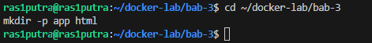

Membuat konfigurasi deklaratif `compose.yaml` yang mengatur segmentasi network (`frontend` dan `backend`), bind mount, named volume `pg-data`, serta healthcheck PostgreSQL:
```bash
cat << 'EOF' > compose.yaml
services:
  web:
    image: nginx:alpine
    ports:
      - "127.0.0.1:8080:80"
    volumes:
      - ./html:/usr/share/nginx/html:ro
      - ./nginx.conf:/etc/nginx/conf.d/default.conf:ro
    networks:
      - frontend
    depends_on:
      - app

  app:
    build:
      context: ./app
    environment:
      DB_HOST: db
      DB_PORT: "5432"
      DB_NAME: labdb
      DB_USER: labuser
      DB_PASS: labpass123
    networks:
      - frontend
      - backend
    depends_on:
      db:
        condition: service_healthy

  db:
    image: postgres:16-alpine
    environment:
      POSTGRES_DB: labdb
      POSTGRES_USER: labuser
      POSTGRES_PASSWORD: labpass123
    volumes:
      - pg-data:/var/lib/postgresql/data
    networks:
      - backend
    healthcheck:
      test:
        - CMD-SHELL
        - pg_isready -U labuser -d labdb
      interval: 5s
      timeout: 5s
      retries: 5

volumes:
  pg-data:

networks:
  frontend:
  backend:
EOF
```

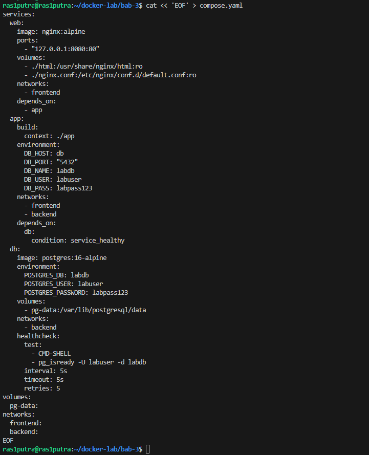

Mendefinisikan dependensi Python pada `app/requirements.txt`:
```bash
cat << 'EOF' > app/requirements.txt
Flask==3.1.2
psycopg[binary]==3.2.9
gunicorn==23.0.0
EOF
```

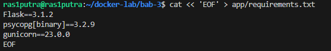

Menulis source code backend Flask pada `app/app.py` yang menyediakan endpoint `/` (query versi DB) dan `/health`:
```bash
cat << 'EOF' > app/app.py
import os
import psycopg
from flask import Flask, jsonify

app = Flask(__name__)

def database_connection():
    return psycopg.connect(
        host=os.environ["DB_HOST"],
        port=os.getenv("DB_PORT", "5432"),
        dbname=os.environ["DB_NAME"],
        user=os.environ["DB_USER"],
        password=os.environ["DB_PASS"],
    )

@app.get("/")
def index():
    try:
        with database_connection() as connection:
            with connection.cursor() as cursor:
                cursor.execute("SELECT version();")
                database_version = cursor.fetchone()[0]

        return jsonify(
            status="ok",
            message="Nginx, Flask, dan PostgreSQL berhasil terhubung",
            database=database_version,
        )
    except Exception as error:
        return jsonify(
            status="error",
            message="Koneksi database gagal",
            detail=str(error),
        ), 500

@app.get("/health")
def health():
    try:
        with database_connection() as connection:
            with connection.cursor() as cursor:
                cursor.execute("SELECT 1;")
                cursor.fetchone()

        return jsonify(status="healthy"), 200
    except Exception:
        return jsonify(status="unhealthy"), 503
EOF
```

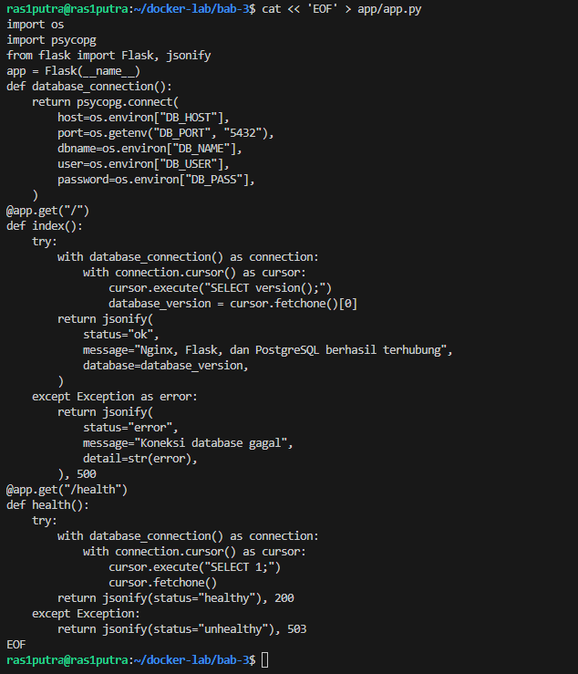

Menulis `app/Dockerfile` dengan penerapan least privilege menggunakan non-root user `appuser` (UID 10001):
```bash
cat << 'EOF' > app/Dockerfile
FROM python:3.12-slim

WORKDIR /app

COPY requirements.txt .
RUN pip install --no-cache-dir -r requirements.txt

COPY app.py .

RUN useradd --system --uid 10001 appuser
USER appuser

EXPOSE 5000

CMD ["gunicorn", "--bind", "0.0.0.0:5000", "--workers", "2", "app:app"]
EOF
```

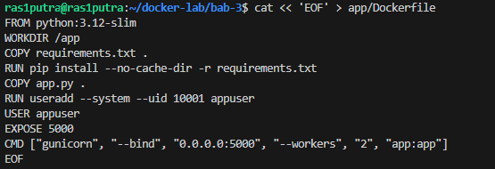

Menulis konfigurasi reverse proxy `nginx.conf`:
```bash
cat << 'EOF' > nginx.conf
upstream flask_backend {
    server app:5000;
}

server {
    listen 80;
    server_name localhost;

    location / {
        proxy_pass http://flask_backend;
        proxy_http_version 1.1;

        proxy_set_header Host $host;
        proxy_set_header X-Real-IP $remote_addr;
        proxy_set_header X-Forwarded-For $proxy_add_x_forwarded_for;
        proxy_set_header X-Forwarded-Proto $scheme;

        proxy_connect_timeout 5s;
        proxy_read_timeout 30s;
    }

    location = /static.html {
        root /usr/share/nginx/html;
    }
}
EOF
```

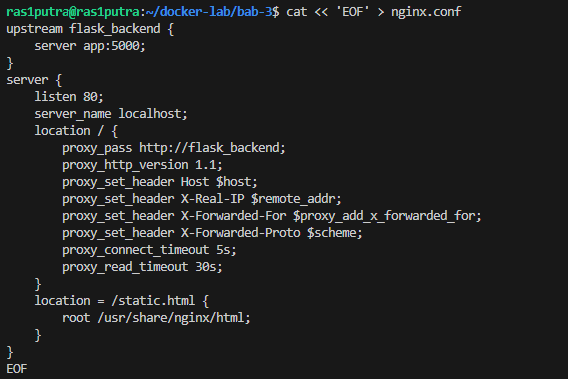

Menulis file HTML statis awal pada `html/index.html`:
```bash
cat << 'EOF' > html/index.html
<!DOCTYPE html>
<html lang="id">
<head>
    <meta charset="UTF-8">
    <title>Laboratorium Docker Compose</title>
</head>
<body>
    <h1>Docker Compose Bab 3</h1>
    <p>Bind mount Nginx berhasil digunakan.</p>
</body>
</html>
EOF
```

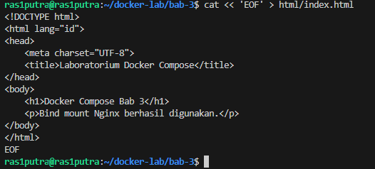

---

#### 4.3.2 Validasi dan Eksekusi Stack Compose

Memvalidasi konfigurasi Compose untuk memastikan tidak ada kesalahan indentasi atau mapping sintaks:
```bash
docker compose config
```

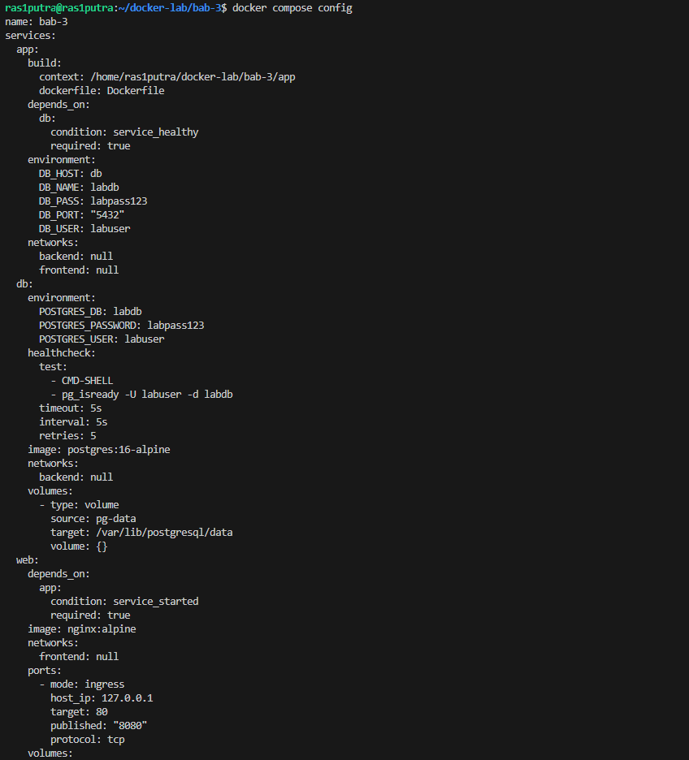

Membangun image backend dan menjalankan seluruh stack di background:
```bash
docker compose up -d --build
```

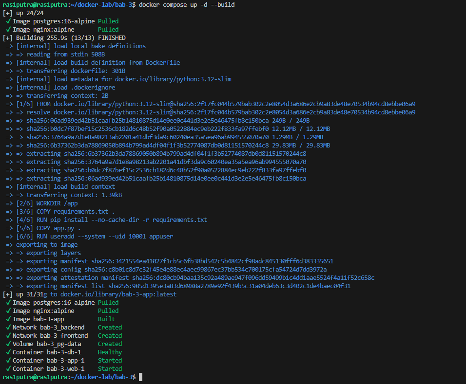

Memeriksa status container dan healthcheck service PostgreSQL:
```bash
docker compose ps
```

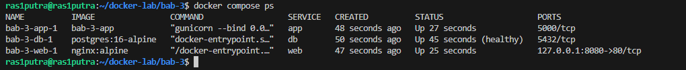

Ketiga service berhasil aktif:
- `bab-3-db-1`: Status `Up (healthy)`, port `5432/tcp` terisolasi di internal network `backend`.
- `bab-3-app-1`: Status `Up`, port `5000/tcp` terhubung ke `frontend` dan `backend`.
- `bab-3-web-1`: Status `Up`, memublikasikan port `127.0.0.1:8080->80/tcp`.

---

#### 4.3.3 Pengujian Endpoint dan Investigasi Bug Routing

Menguji endpoint API root `/`, endpoint `/health`, dan `/static.html`:
```bash
curl http://localhost:8080/
curl -i http://localhost:8080/health
curl http://localhost:8080/static.html
```

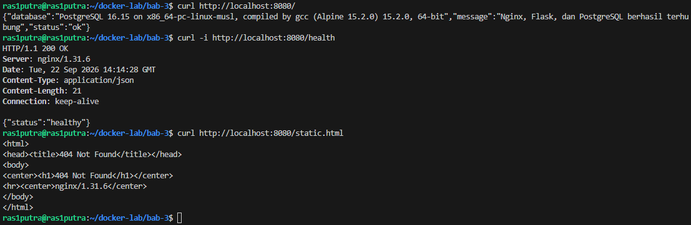

Pada pengujian ini, endpoint `/` sukses menampilkan informasi database PostgreSQL 16.15, dan `/health` mengembalikan HTTP 200 `{"status":"healthy"}`. Namun, endpoint `/static.html` menghasilkan `404 Not Found` karena nama file di direktori host adalah `index.html`.

Perbaikan dilakukan dengan menyalin file menjadi `html/static.html`, lalu diuji ulang:
```bash
cp html/index.html html/static.html
curl http://localhost:8080/static.html
```

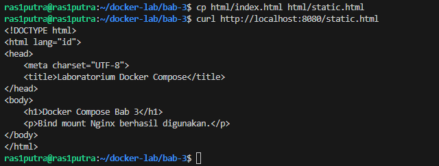

Setelah perbaikan nama file, Nginx langsung menyajikan file HTML statis melalui bind mount tanpa perlu merestart container.

## 5. Hasil Pengujian

### 5.1 Tabel Verifikasi Fungsional

| Skenario Pengujian | Perintah Eksekusi | Hasil Aktual | Status |
|---|---|---|---|
| Resolusi DNS Bridge Network | `docker exec server-a ping -c 3 server-b` | Resolusi nama `server-b` ke `172.20.0.3`, 0% loss | Terpenuhi |
| Persistensi Docker Volume | `docker run --rm -v data-vol:/data ... cat` | 8 entri log tetap ada setelah container `writer` musnah | Terpenuhi |
| Backup Volume ke Arsip Tar | `docker run --rm ... tar czf ...` | Terbentuk file `data-vol-backup.tar.gz` (183 byte) | Terpenuhi |
| Validasi Deklaratif Compose | `docker compose config` | Skema valid tanpa error sintaks | Terpenuhi |
| Healthcheck PostgreSQL | `docker compose ps` | Container DB berada dalam status `Up (healthy)` | Terpenuhi |
| Koneksi Reverse Proxy & DB | `curl http://localhost:8080/` | Status `ok`, respons PostgreSQL 16.15 alpine | Terpenuhi |
| Liveness/Health API Endpoint | `curl -i http://localhost:8080/health` | HTTP/1.1 200 OK, `{"status":"healthy"}` | Terpenuhi |
| Bind Mount Serving File | `curl http://localhost:8080/static.html` | Mengembalikan HTML statis setelah koreksi nama file | Terpenuhi |

### 5.2 Bukti Output Verifikasi Utama

1. Output Respons API Nginx → Flask → PostgreSQL:
```json
{
  "database": "PostgreSQL 16.15 on x86_64-pc-linux-musl, compiled by gcc (Alpine 15.2.0) 15.2.0, 64-bit",
  "message": "Nginx, Flask, dan PostgreSQL berhasil terhubung",
  "status": "ok"
}
```

2. Output Status Health HTTP:
```text
HTTP/1.1 200 OK
Server: nginx/1.31.6
Date: Tue, 22 Sep 2026 14:14:28 GMT
Content-Type: application/json
Content-Length: 21
Connection: keep-alive

{"status":"healthy"}
```

## 6. Threat Statement

1. **Exposure Port Database Tanpa Isolasi Jaringan**: Jika service database PostgreSQL memublikasikan port `5432:5432` ke antarmuka host, database akan terbuka ke seluruh jaringan fisik atau internet. Pada arsitektur praktikum ini, segmentasi diterapkan: database hanya bergabung ke network `backend` tanpa direktif `ports`, sehingga hanya service `app` yang dapat menjangkaunya.
2. **Risiko Akses Tulis pada Bind Mount Host**: Penggunaan bind mount memberikan akses container langsung ke filesystem host. Apabila container disusupi dan berjalan sebagai user root, penyerang dapat memodifikasi file konfigurasi host atau menanam backdoor. Solusi mitigasinya adalah menerapkan flag read-only (`:ro`) seperti pada `./nginx.conf:...:ro` dan `./html:...:ro`.
3. **Penyimpanan Credential Polos pada Environment Variables**: Mendefinisikan password database (`POSTGRES_PASSWORD: labpass123`) di file Compose atau environment variable berisiko terekspos melalui perintah `docker inspect`, file log, maupun process table (`ps aux`). Untuk lingkungan non-lab, mekanisme Docker Secrets atau secret manager eksternal wajib digunakan.
4. **Kehancuran Data Akibat `docker compose down -v`**: Opsi flag `-v` akan menghapus seluruh named volume proyek (`pg-data`). Kesalahan eksekusi perintah ini pada production dapat menyebabkan kehilangan data permanen seketika.

## 7. Analisis dan Temuan Masalah

### 7.1 Temuan Masalah 1: Error 404 Not Found pada Endpoint `/static.html`
- **Gejala & Diagnosis**: Saat mengeksekusi `curl http://localhost:8080/static.html`, web server Nginx mengembalikan kode status `404 Not Found`. Melalui penelusuran file konfigurasi `nginx.conf`, terdapat directive:
  ```nginx
  location = /static.html {
      root /usr/share/nginx/html;
  }
  ```
  Nginx mencari file fisik dengan path `/usr/share/nginx/html/static.html`. Namun, panduan cheatsheet mengarahkan pembuatan file bernama `html/index.html`. Karena file `static.html` tidak ada di folder mount, Nginx gagal menyajikannya.
- **Solusi Korektif**: Menyalin file `cp html/index.html html/static.html`. Pengujian ulang langsung mengembalikan kode 200 OK berisi dokumen HTML secara instan, membuktikan bahwa bind mount merefleksikan pembaruan file host ke dalam container secara realtime tanpa perlu build ulang image.

### 7.2 Analisis Mekanisme Resolusi DNS Internal vs Default Bridge
Pada default bridge network (`docker0`), container hanya dapat saling berkomunikasi via alamat IP atau link legacy (`--link`). Hal ini sangat rapuh karena IP container bersifat ephemeral. Pada praktikum ini, pembuatan user-defined bridge (`lab-net` dan network Compose) mengaktifkan embedded DNS server Docker di IP `127.0.0.11`. Mekanisme ini memetakan nama container ke alamat IP aktifnya, memungkinkan komunikasi yang andal antar microservices.

### 7.3 Peran Condition Service Healthy pada Startup Dependensi
Instruksi `depends_on` standar hanya memastikan container database telah *started* (proses telah dipanggil oleh kernel), bukan *ready* menerima koneksi TCP. PostgreSQL memerlukan waktu inisialisasi socket dan database cluster. Penambahan healthcheck:
```yaml
healthcheck:
  test: ["CMD-SHELL", "pg_isready -U labuser -d labdb"]
  interval: 5s
  timeout: 5s
  retries: 5
```
dan dependensi bersyarat `condition: service_healthy` pada service `app` menjamin aplikasi Flask tidak akan dijalankan sebelum PostgreSQL benar-benar lolos uji kesiapan `pg_isready`. Hal ini mencegah kegagalan *connection refused* saat startup awal.

## 8. Rekomendasi untuk Production

1. **Batasi Binding Port ke Loopback atau Private Gateway**: Selalu gunakan pembatasan IP host eksplisit (`127.0.0.1:8080:80`) bukan `8080:80` untuk mencegah layanan terekspos langsung ke antarmuka publik host tanpa melewati reverse proxy atau firewall luar.
2. **Gunakan Docker Secrets untuk Password**: Hindari menulis plain credential pada `environment`. Gunakan top-level `secrets` pada Compose yang dimount sebagai file in-memory di `/run/secrets/` dengan permission ketat.
3. **Terapkan Least Privilege User**: Seperti yang diterapkan pada `app/Dockerfile`, aplikasi Flask dijalankan di bawah akun `appuser` (UID 10001), bukan root. Ini memitigasi risiko *privilege escalation* ke host bila terjadi celah keamanan pada aplikasi.
4. **Otomatisasi Backup Database dengan Snapshot / Logical Dump Terenkripsi**: Backup volume database berbasis file tar saat container hidup dapat menghasilkan data yang tidak konsisten (*dirty read*). Gunakan `pg_dump` terjadwal yang dikirim ke object storage terenkripsi di luar node.
5. **Gunakan Resource Limit**: Tambahkan batasan `deploy.resources.limits` (CPU dan memory) pada setiap service di Compose agar lonjakan trafik atau kebocoran memori pada satu container tidak menumbangkan seluruh server.

## 9. Kesimpulan

Praktikum Bab 3 berhasil mengonfirmasi dan memvalidasi pilar-pilar penting dalam arsitektur container modern:
1. **Network**: User-defined bridge network membuktikan kemampuan isolasi lalu lintas data dan efektivitas resolusi nama otomatis (*embedded DNS*) yang menyederhanakan komunikasi service-to-service.
2. **Storage**: Docker Volume terbukti menjamin persistensi state data melampaui siklus hidup container, sementara bind mount menawarkan fleksibilitas konfigurasi file host secara langsung dengan proteksi read-only.
3. **Orkestrasi Compose**: Docker Compose secara efisien mengelola multi-tier stack (Nginx, Flask, PostgreSQL) dengan segmentasi dual-network (`frontend` dan `backend`) serta orkestrasi startup berbasis *healthcheck readiness*.
4. **Problem Solving**: Investigasi error 404 pada route `/static.html` memberikan pemahaman mendalam mengenai relasi mapping direktori mount antara filesystem host dan web server Nginx.

## 10. Evaluasi dan Latihan Mandiri

**1. Mengapa user-defined bridge lebih baik daripada default bridge untuk multi-container app?**

User-defined bridge jauh lebih unggul karena menyediakan resolusi DNS otomatis berdasarkan nama container atau alias service. Pada default bridge, komunikasi antar-container hanya dapat dilakukan menggunakan alamat IP (yang selalu berubah setiap kali container dibuat ulang) atau menggunakan flag legacy `--link` yang sudah ditinggalkan. Selain itu, user-defined bridge memberikan isolasi jaringan yang lebih baik: container yang berada di jaringan bridge berbeda tidak dapat saling mengakses secara langsung, meminimalkan attack surface antar-aplikasi yang berbeda pada satu host. Pengaturan environment dan konfigurasi MTU/subnet pada user-defined bridge juga dapat dikustomisasi secara independen.

**2. Apa risiko bind mount terhadap keamanan host?**

Risiko utama bind mount terletak pada pemberian akses langsung proses di dalam container ke direktori filesystem host. Apabila container dieksekusi dengan user root (default) dan berhasil disusupi oleh penyerang, penyerang tersebut memiliki hak akses tulis penuh ke file host yang di-mount. Penyerang dapat mengubah konfigurasi sistem kritis, membaca credential sensitif host, atau menanam binary berbahaya. Selain itu, jika host path di-mount ke direktori sistem container yang sudah ada, bind mount akan menimpa/menutupi (*masking*) isi direktori asli container. Risiko ini dapat diminimalkan dengan selalu menambahkan opsi read-only (`:ro`) jika container tidak membutuhkan hak tulis, serta memastikan container berjalan dengan user non-root.

**3. Apa perbedaan `docker compose down` dan `docker compose down -v`?**

`docker compose down` menghentikan dan menghapus seluruh container, network, dan anonymous image yang didefinisikan dalam stack, namun **tetap mempertahankan named volume**. Data database atau storage persisten yang tersimpan di dalam volume tidak akan hilang. Sebaliknya, `docker compose down -v` (atau `--volumes`) menghapus container, network, **sekaligus seluruh named volume** yang terasosiasi dengan project tersebut. Perintah kedua bersifat destruktif (*irreversible*) terhadap state data aplikasi dan harus dihindari di lingkungan produksi kecuali memang berniat mereset seluruh database dari awal.

**4. Kapan `depends_on` dengan healthcheck lebih tepat daripada `depends_on` biasa?**

`depends_on` biasa hanya memantau status siklus hidup container pada tingkat kernel/OS — yaitu sekadar memastikan container target telah mencapai status *running/started*. Pada kenyataannya, banyak service kompleks seperti database (PostgreSQL, MySQL) memerlukan proses inisialisasi internal (alokasi memori, pemulihan WAL log, pembukaan socket jaringan) beberapa detik sebelum benar-benar siap menerima koneksi client. Jika service backend bergantung pada `depends_on` biasa, backend dapat mengalami *crash loop* karena mencoba melakukan query saat database belum siap. `depends_on` yang dikombinasikan dengan `condition: service_healthy` memastikan bahwa container dependent baru akan dijalankan setelah target benar-benar lolos pengujian fungsional (misalnya perintah `pg_isready`), menjamin stabilitas startup stack aplikasi.

**5. Bagaimana strategi backup volume untuk database produksi?**

Strategi backup volume database produksi tidak boleh sekadar menyalin file storage mentah saat database sedang beroperasi, karena berisiko mengalami *data corruption* atau *partial write*. Strategi yang tepat meliputi:
1. **Logical Backup Terjadwal**: Menjalankan tool native seperti `pg_dump` atau `mysqldump` secara berkala via cron job atau container sidecar untuk menghasilkan dump SQL konsisten yang kemudian dikompresi dan dikirim ke cloud object storage (misalnya AWS S3) terenkripsi.
2. **Point-in-Time Recovery (PITR)**: Mengaktifkan continuous archiving dari Write-Ahead Logging (WAL) sehingga database dapat dipulihkan ke titik detik tertentu sebelum terjadinya insiden.
3. **Volume Snapshot Konsisten**: Jika menggunakan block storage (seperti AWS EBS atau Ceph), lakukan pembekuan operasi I/O database sejenak (`CHECKPOINT` / freeze), lakukan storage snapshot, lalu lepas pembekuan.
4. **Disaster Recovery Exercise**: Melakukan uji restore data secara rutin ke lingkungan pengujian terisolasi untuk memastikan file backup tidak korup dan prosedur pemulihan (*Recovery Time Objective* dan *Recovery Point Objective*) berjalan sesuai SLA.

## 11. Referensi

1. Ferry Astika Saputra, "Bab 3 — Docker Network, Volume, Bind Mount, tmpfs, dan Compose," repository DevSecOps PENS, `bab-03.md`, diakses 22 September 2026: https://github.com/ferryas-pens/devsecops/blob/main/bab-03.md
2. Ferry Astika Saputra, "Panduan Praktikum Bab 3: Docker Network, Volume, dan Compose," `cheatsheets/bab-03-cs.md`, repository DevSecOps PENS, diakses 22 September 2026.
3. Docker Documentation, "Networking overview & Bridge network driver," https://docs.docker.com/network/
4. Docker Documentation, "Manage data in Docker & Volumes," https://docs.docker.com/storage/volumes/
5. Docker Documentation, "Compose file specification & Healthchecks," https://docs.docker.com/compose/compose-file/
